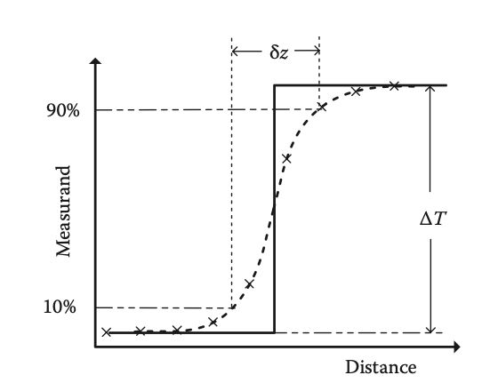
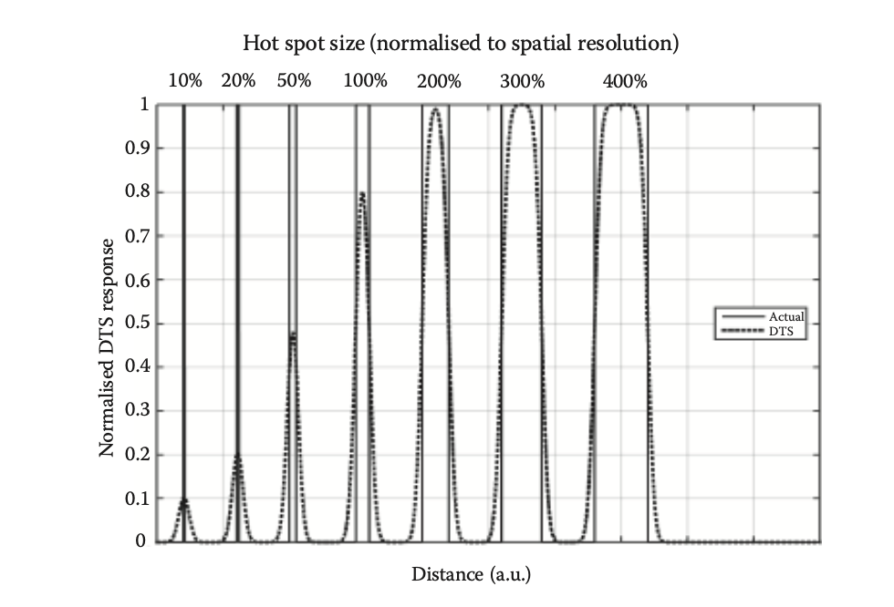

<head>
  
  
</head>

# Foundation Part

1.  **What is Distributed Optical Fibre Sensors(DOFSs)?分布式光纤传感器**

    They determine spatial distribution of the measurands along the fibre often many kilometres long.

2.  **What is the key aspects of the performance of DOFSs?**

    1. **the measurand resolution**
        
        The ability for the sensor to distinguish small changes in the value of the quantity that is measured. In general, it's a function of location because the signal is increasingly attenuated with increasing distance.

    2. **the spatial resolution**
   
        The ability to distinguish the value of the measurand at close locations.

        The spatial resolution $\delta z$ is usually defined as the distance over which the sensor output corresponding to an abrupt transition is spread, estimated between 10% and 90% points on the transition.
        
        

        When the width of the measurand is smaller or equal to the width of spatial resolution, the value measured will be lower than actual value as the picture.
    
        

        
    3. **the range**
   
        The maximum length of the fiber that the sensor can measure.

        This value will also dictate the maximum pulse repetition rate. Because we must wait until the backscatter returned to the launch end from the far end.

    4.  **the measurement time to achieve the stated measurement resolution**

