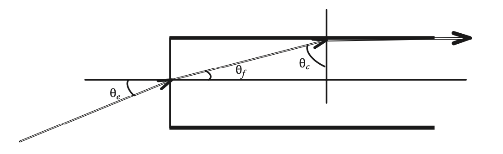
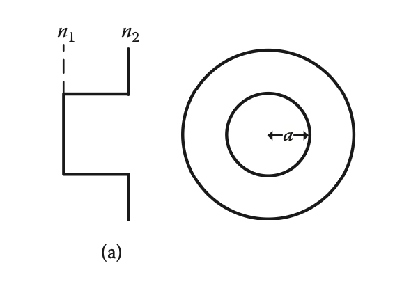
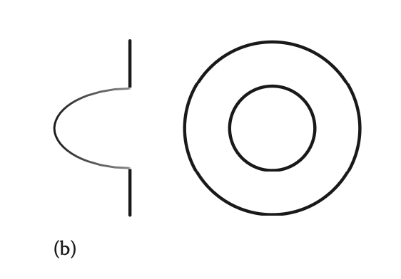

<head>
  
  
</head>

- [Propagation in Optical Fiber](#propagation-in-optical-fiber)
  - [Step-index multimode fiber 阶跃折射率多模光纤](#step-index-multimode-fiber-阶跃折射率多模光纤)
  - [Graded-index multimode fiber 渐变折射率多模光纤](#graded-index-multimode-fiber-渐变折射率多模光纤)

# Propagation in Optical Fiber

word|meaning
---|---
meridional ray|子午光线：子午面是轴外物点和光轴确定的面
sagittal ray|弧矢光线：弧矢面是垂直于子午面的面
critical angle|临界角
fiber core|纤芯
fiber cladding|光纤包层
normalised frequency|归一化频率
waveguide|波导
guided wave|导波
guided mode|导模
group velocity|群速度：波包传播的速度
phase velocity|相速度：等相位面传播的速度
pulse spreading|脉冲展宽：一条长度相同的光纤上，最高次模与最低次模到达终点所用的时间差

1. **When total reflection happens, what's the incidence angle like?**

 The incidence angle must bigger than the critical angle. 
 
 The critical angle is defined as $\sin \theta _c=\frac{n_2}{n_1}$ .

2. **What's the numerical aperture in the optical fiber?**

 $$n_0\sin \theta_{emax} =n_1\sin (\frac{\pi}{2}-\theta _c)=n_2\cos \theta _c \rightarrow \sin \theta_{emax}=\sqrt{n_1^2-n_1^2(\frac{n_2}{n_1})^2}$$
 
 $$\text{NA}=\sin \theta_{emax}=\sqrt{n_1^2-n_2^2}$$

 Worth noticing that $n_1$ is the refractive index of the fibre core and $n_2$ is the refractive index of the fiber cladding.

 

3. **What is normalised frequency?**

 It dictates whether or not next mode is guided. As the value increasing, more modes can be guided by the fiber.

 $$V=\frac{2\pi}{\lambda}a\text{NA}$$

 $a$ is the core radius.

4. **What's waveguide,guided wave,guided mode?**
   - wave guide : It's a device that transfers energy from one place to another.
   - guided wave:A wave that is restricted from propagating in a medium due to the existence of a medium boundary and whose propagation direction is parallel to the medium boundary.
   - guided mode:A mode capable of transmitting without cut-off attenuation along the guidance system

## Step-index multimode fiber 阶跃折射率多模光纤

 - **The number of guided mode is approximately equal to $\frac{V^2}{2}$**
 - **relative index-difference**

   $$\Delta =\frac{\text{NA}^2}{n_1^2}=\frac{n_1^2-n_2^2}{n_1^2}$$ 

 - **pulse spreading**

 $$\delta _{SI}=\frac{L}{c}(1-V/2)(n_1-n_2)$$

 脉冲展宽是由多径色散引起的，宽度就会拓展
 
 多径色散：经过同一长度的光纤的光程不一样，所需的时间也不一样

   

## Graded-index multimode fiber 渐变折射率多模光纤
 -  **The number of guided mode is approximately equal to $\frac{V^2}{4}$**
 - **pulse spreading**
  
  $$\delta _{GI}=\frac{L}{c}n_1\frac{\Delta ^2}{8}$$

  Usually the pulse spreading in graded-index fiber is smaller than in step-index fiber. Because most of the light are reflected before getting the interface of core and cladding. The optical path is roughly the same so it's smaller.
 - **A common standard for multimode**： graded-index fibre specifies *a core diameter of 50 μm and an NA of 0.2*(for multimode fibre, the definition of NA is based on the refractive index at the centre of the core).

 -  **modal power distribution 模态功率分布**
  The fraction of the total power launched into a multimode fibre that is carried by each mode
 
 

## single-mode optical fiber

 - It can ensure that only the lowest-order mode is propagated.